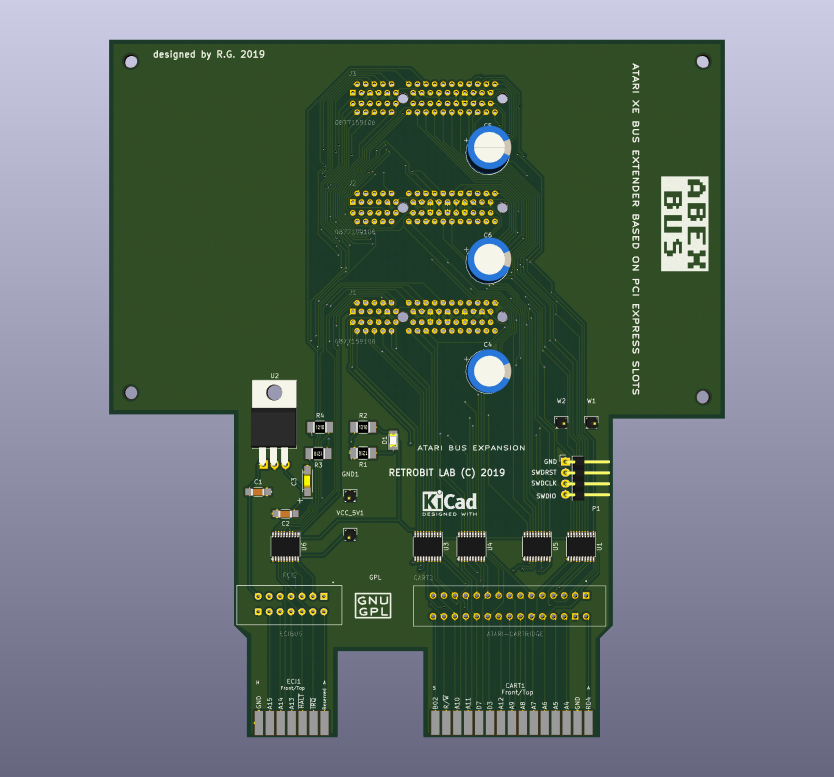
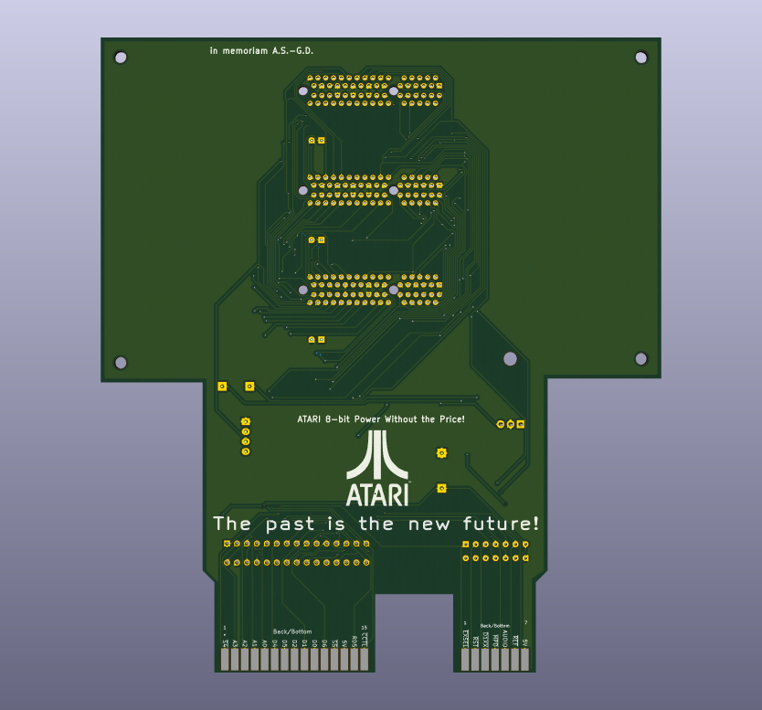
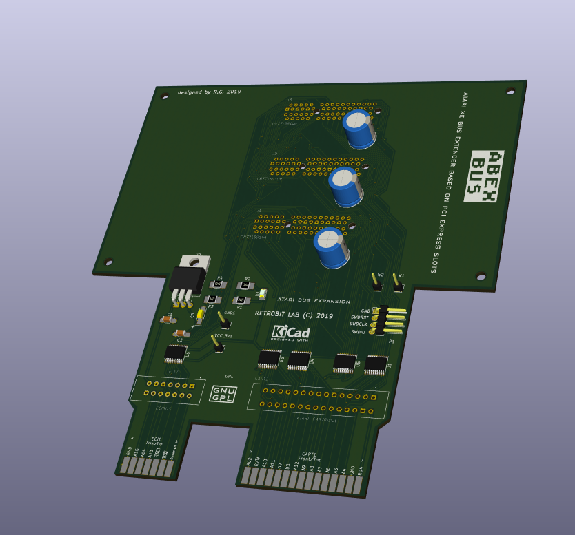

Atari Bus EXtender for Atari XE Computers
=====================================

This is a Atari PBI & ECI Bus extender, for adding expansion board with ease,
called Atari Bus EXtender for Atari XE Computers or ABEX for short.

This project expand somehow the Atari 1090XL Bus Expansion in the early 80s
but with a simple layout and using only 3.3v compliant electronics.
No 5V is available on the bus, and all signals are converted to 3.3v level.

The Bus recall somehow the AteoBus from Amiga 1200 Computers but using a
more common nowadays PCI-Express Bus Slots with 64 pins.

Right now there are 2 boards desinged for this bus:

1- Atari DUO Cart (a porting of the famous Uno-Cart Project)

2- Atari MegaRAM (a PortB PIA Emulator) with 1024K RAM memory banked

More boards can be added as soon they do not interfere with the others
like using the PBI Protocol device in available in ROM. For example a simple
RS232 Board can be designed using a STM32F407 as port EXPANDER with R: handler
in internal flash, or a SDCard Hard Drive Simulator can be designed as well.

Even WiFi or Ethernet Controller can be achived flawlessly.

Everything is up to you, using your mind to open the world to this wonderful
machine like Atari 130XE.

Rendered Images
===============
# Front
# Back
# Overall

Hardware License
================
Copyright (C) 2018/2019 Gianluca Renzi <gianlucarenzi@eurek.it> <icjtqr@gmail.com>

The hardware of this project is released as free/open hardware under the
Creative Commons Attribution Share-Alike license. See `LICENSE.hw` for details.

Firmware License
================
Copyright (C) 2019 Gianluca Renzi <icjtqr@gmail.com>

The microcontroller firmware of this project is released as free software,
under the terms of the GNU General Public License v3, or later.  See
`LICENSE.sw` for details.

Software License
================
The host software (amigafloppy tool) is released as free software, under the
terms of the GNU General Public License v3, or later. See `LICENSE.sw` or licence.txt for
details.
